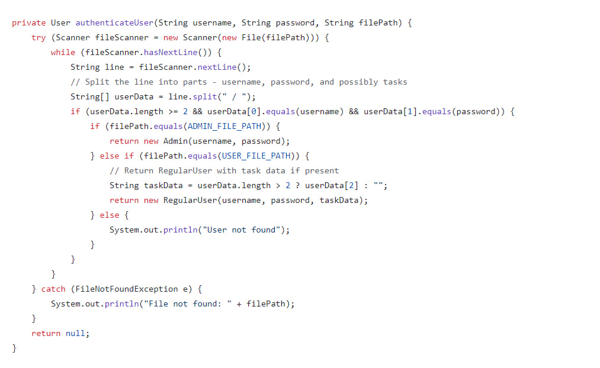

# Project Name: Task Management 
#### Member: Keo Munin & Kry Sorachna 

## I. Introduction
#### A. About the Project
       The project focuses on task management, offering users an improved solution for managing tasks with effective functions.
       With more visibility of the teamwork environment, the system allows users to work and communicate
       confidentially within the association.
#### B. About the functions
       This project will provide authentication to two different users, admin and normal users. 
##### 1. Register/ Log in
      The system will take username and password as the user information saved within the database. After registering or logging in the system will serve the user based on the following commands and functionalities. 
##### 2. Task management:
      The system's core value, Task management, is where all the implementation and communication are made. This function allows users to create tasks, assign tasks, and set necessary parameters as we will take the following data as required: 
      **Admin input: **
      - Project name
      - Add task 
      - Assigned task owner
      - Set/view deadline 
      - Set/view task status
      **Normal User input: **
      - Add/view task
      - View deadline
      - Update task status
## II. Directory Structure
      To maintain friendly access and organized code, this code structure was separated into two different folders, Task management and User. 
      In the Task Management folder, you will find the main file such as Program.java, and other necessary files of functions stored. 
      Whereas, inside the User folder, you will find all the functions that mainly focus on taking in and storing user information as txt.file. 
      Regarding the separation, however, all the classes remain related and all are part of the Program.java  file. 
#### -->Folder Task management
	To access to files in "TaskManagement" directory navigate to: [TaskManagement](https://shorturl.at/aEJR9)
##### 1. Classes
###### a. Program.java
      Java class that contains the main () method to compile and execute the program. In this main file, the program will ask for user 
      input on three main options based on  their purpose to use the program as the entry point for the application. Regarding the three 
      options of login, register, and exit, functions such as .login() and .registerUser() were called for further implementation. 
###### a. AdminFunction.java
      The main purpose of this class is to allow Admin to create projects and tasks. It has two functions: .handleAdminActions( ) and .printAdminReport( ).  
###### b. RegularUserFunction.java
	This class is created to allow to user to perform actions such as view and update tasks as complete by creating .handelUserActions( ) function. 
###### c. Project.java and Task.java
    These classes represent the core entities of the program.
##### 2. Function
	i. .handleAdminActions(): A function inside the AdminFunction class that implements project and task creation for admin. 
	ii. .printAdminReport( ): A function inside the AdminFuncion class that takes the initiative to generate all the existing projects and tasks after the admin ends the implementation of creating or adding them.
	iii. .handleUseActions( ): A function inside the RegularUserFunction class that gives the user access to implement view and update their task as well as its status. 
#### --> Folder User
	To access files in "Use" directory, navigate to: [User](https://shorturl.at/bsL17)
##### 1. Classes
###### a. User (Superclass) 
	An abstract superclass class that has two objects, username and password. The reason that set User as a superclass is that we expect to have multiple types of users using our program for example we have admin and regular user. As for the abstract class, since all the users need to log in before using our application therefore we use the abstract method to make sure all the subclasses that inherit from the superclass need to also implement login. 
 ###### b.Admin (subclass)
 	A subclass inheritance from the Superclass User. Admin is the type of user that can perform more actions than regular users such as creating projects, adding tasks, assigning task owners, and viewing the task status that has been updated by the task owner or regular user.
 ###### c. RegularUser (Inheritance)
 	A subclass that also the inheritance of the User class. 
 ###### d.Register.java
	We create this class for all the related functions for the register process including the function for users who register as regular users and the function for users who register as admin. 
 	In this class, we store the user's data to paths that we had created and the register function will be called to use with registerUser function in the Usermanager.java class. 
 ###### Usernamanager.java
        This class was created to store all the functions that are used to manage  user data. For example, registeruser, athenticateUser , promtlogin, etc. 
#### Essential part of the project
##### Polymorphism: Casting (Overriding and Overloading method)
###### casting
	Link to Admin.java: https://shorturl.at/inqCJ
	Code line: userManager.displayAdminReportFromFile((Admin) user); 
        *User being cast to Admin
###### Overriding 
	
	The overriding method was used on both the Admin and the RegularUser class because we want to override the login function User and add on some special conditions such as secrete password in the admin class. 
###### Overloading
	
	We use Overload method both inside the Admin and RegularUser class as function displayUserInfo.() was called to use but they have different parameters. 
##### Encapsulation: (Private, Public, protected)
	
	We set username as protected because we only want to class that extends from the user can access it. 
 	We set password as private because we don't want to show it or anyone can access it without permission. 
##### Abstraction: (Abstract method, overriding abstract method)
Link for User file:https://shorturl.at/dEIK1
	The abstract method is used to make sure that classes that extend from the User class implement all the requirements that the User class has. 
##### Exception Handling
	
	We use **Exception **to avoid system crashes when the user is not found.
##### File I/O
	
	This authentication function is created to identify whether the login user is an admin or a regular user or not in the system. If not in the system then we apply **Exception method** to handle this problem.
##### Anonymous inner class or functional interface
	
	

	

